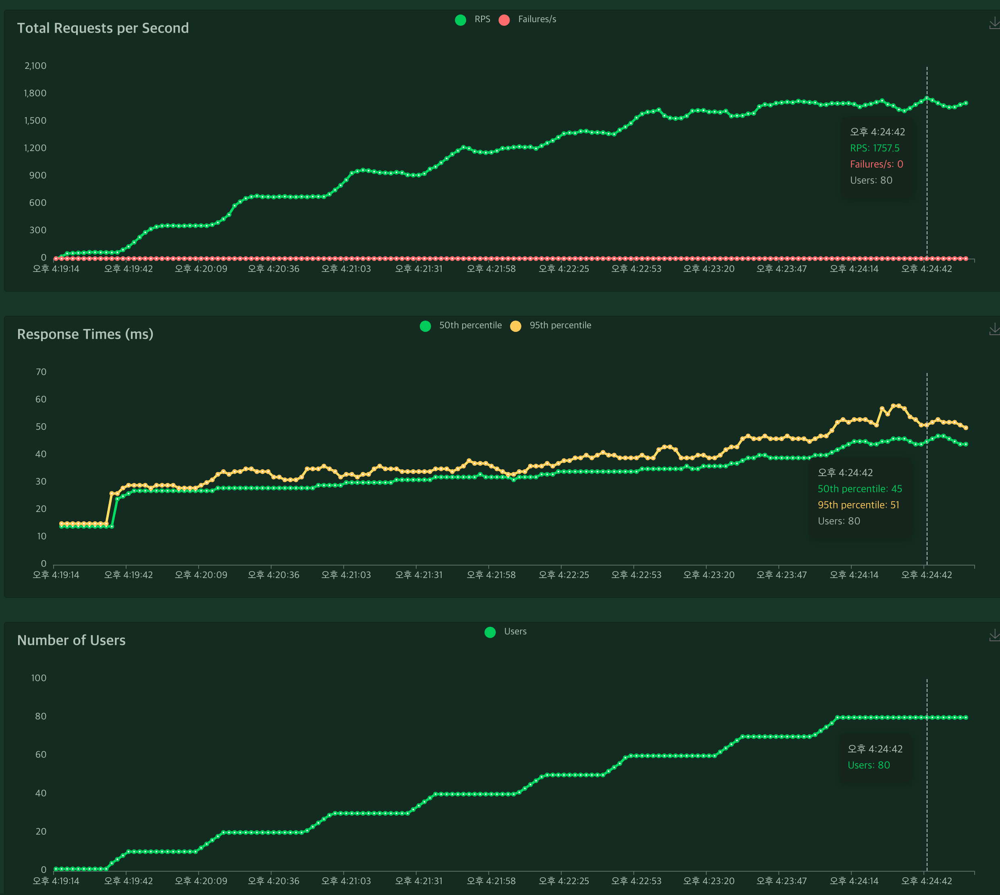
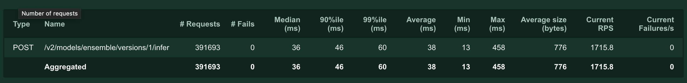
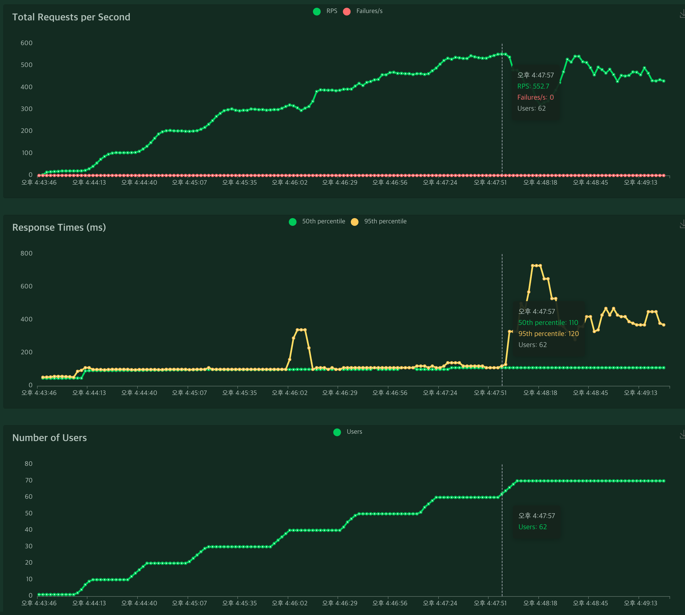
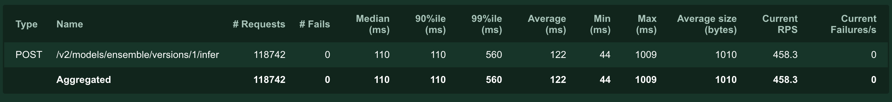
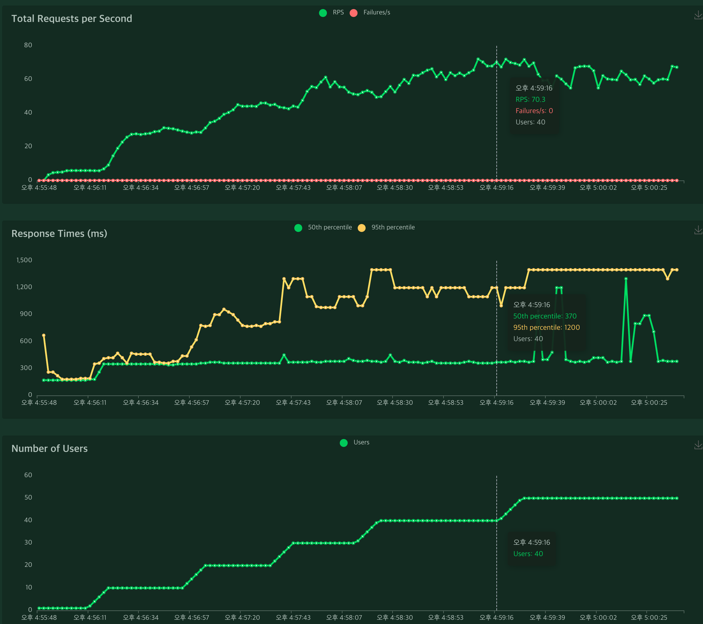
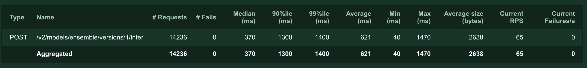
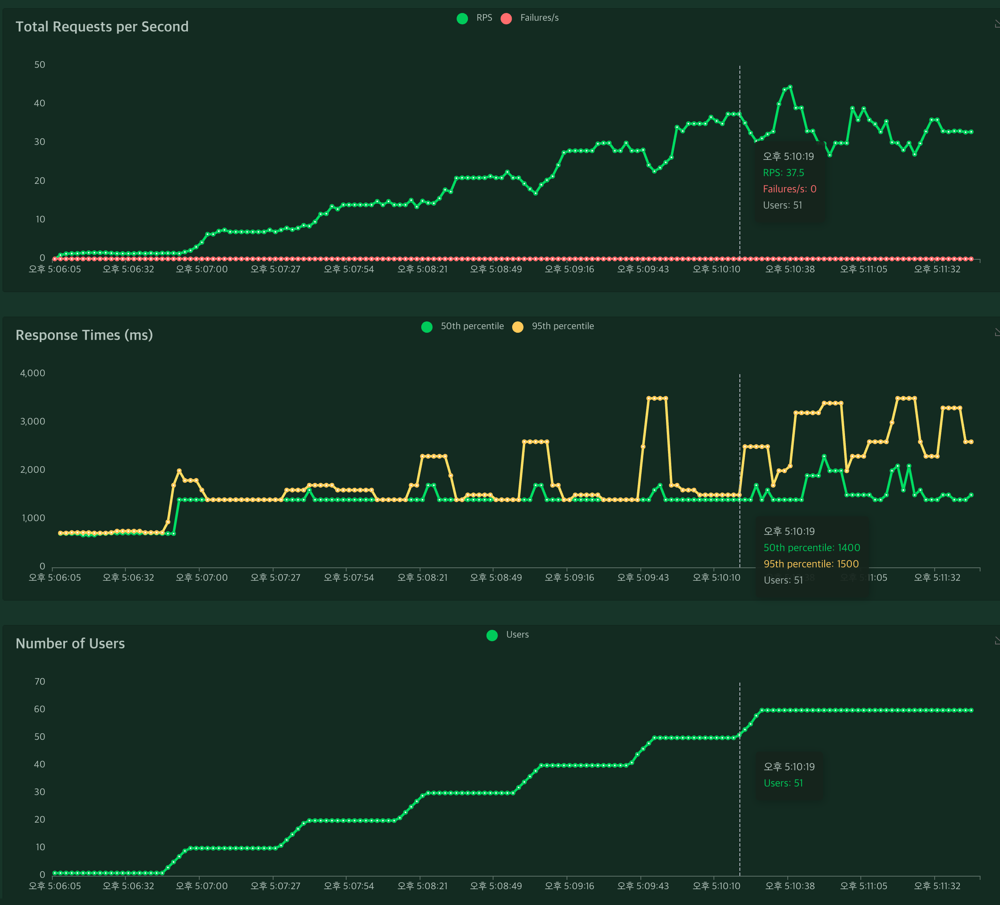

# Serving codegen-350M-mono-gptj with Triton

## Requirements
As for https://huggingface.co/moyix/codegen-350M-mono-gptj ,
- Set up the client
- Set up a server

## How to Run

### Option1. Docker
```bash
docker compose up   # Run the server & client.
```

Open http://localhost:7860

### Option2. Kubernetes
- Install [Helm](https://helm.sh/docs/intro/install/)

#### Create a Service Cluster
```bash
make cluster
make charts
```

#### Access to Client
Open http://localhost:7860

#### Access to Grafana
```bash
kubectl port-forward svc/prometheus-grafana 3000:80
```
Open http://localhost:3000
- id: admin
- pw: prom-operator

If you want to configure loki as data sources to monitor the service logs:
1. Configuration -> Data sources -> Add data sources
2. Select Loki
3. Add URL: http://loki.default.svc.cluster.local:3100
4. Click Save & test on the bottom.
5. Explore -> Select Loki
6. job -> default/client-codegen-client -> Show logs

#### Triton Auto-Scaling
You need to increase `maxReplicas` in `charts/triton/values.yaml`.
```bash
# For example,
autoscaling:
  minReplicas: 1
  maxReplicas: 2
```
By default, the autoscaling metic is average queuing time 50 ms for 30 seconds.
You can set the target value as you need.
```bash
autoscaling:
  ...
  metrics:
    - type: Pods
      pods:
        metric:
          name: avg_time_queue_us
        target:
          type: AverageValue
          averageValue: 50000  # 1,000 us == 1 ms
```

#### Finalization
```bash
make remove-charts
make finalize
```

## Artifacts
- TritonServer with FasterTransformer: https://gitlab.com/curt-park/tritonserver-ft
- CodeGen-350M-mono-gptj: https://huggingface.co/curt-park/codegen-350M-mono-gptj

## For Developer
```bash
make setup      # Install packages for execution.
make setup-dev  # Install packages for development.
make format     # Format the code.
make lint       # Lint the code.
```

## Experiments: Load Test

Device Info:
- CPU: AMD EPYC Processor (with IBPB)
- GPU: A100-SXM4-80GB x 1
- RAM: 1.857TB

Experimental Setups:
- Single Triton instance.
- Dynamic batching.
- Triton docker server.
- Output Length: 8 vs 32 vs 128 vs 512

### Output Length: 8


```bash
# metrics
nv_inference_count{model="ensemble",version="1"} 391768
nv_inference_count{model="postprocessing",version="1"} 391768
nv_inference_count{model="codegen-350M-mono-gptj",version="1"} 391768
nv_inference_count{model="preprocessing",version="1"} 391768

nv_inference_exec_count{model="ensemble",version="1"} 391768
nv_inference_exec_count{model="postprocessing",version="1"} 391768
nv_inference_exec_count{model="codegen-350M-mono-gptj",version="1"} 20439
nv_inference_exec_count{model="preprocessing",version="1"} 391768

nv_inference_compute_infer_duration_us{model="ensemble",version="1"} 6368616649
nv_inference_compute_infer_duration_us{model="postprocessing",version="1"} 51508744
nv_inference_compute_infer_duration_us{model="codegen-350M-mono-gptj",version="1"} 6148437063
nv_inference_compute_infer_duration_us{model="preprocessing",version="1"} 168281250
```

- RPS (Response per Second) reaches around 1,715.
- The average response time is 38 ms.
- The metric shows dynamic batching works (`nv_inference_count` vs `nv_inference_exec_count`)
- Preprocessing spends 2.73% of the model inference time.
- Postprocessing spends 0.83% of the model inference time.

### Output Length: 32


```bash
# metrics
nv_inference_count{model="ensemble",version="1"} 118812
nv_inference_count{model="codegen-350M-mono-gptj",version="1"} 118812
nv_inference_count{model="postprocessing",version="1"} 118812
nv_inference_count{model="preprocessing",version="1"} 118812

nv_inference_exec_count{model="ensemble",version="1"} 118812
nv_inference_exec_count{model="codegen-350M-mono-gptj",version="1"} 6022
nv_inference_exec_count{model="postprocessing",version="1"} 118812
nv_inference_exec_count{model="preprocessing",version="1"} 118812

nv_inference_compute_infer_duration_us{model="ensemble",version="1"} 7163210716
nv_inference_compute_infer_duration_us{model="codegen-350M-mono-gptj",version="1"} 7090601211
nv_inference_compute_infer_duration_us{model="postprocessing",version="1"} 18416946
nv_inference_compute_infer_duration_us{model="preprocessing",version="1"} 54073590
```
- RPS (Response per Second) reaches around 500.
- The average response time is 122 ms.
- The metric shows dynamic batching works (`nv_inference_count` vs `nv_inference_exec_count`)
- Preprocessing spends 0.76% of the model inference time.
- Postprocessing spends 0.26% of the model inference time.

### Output Length: 128


```bash
nv_inference_count{model="ensemble",version="1"} 14286
nv_inference_count{model="codegen-350M-mono-gptj",version="1"} 14286
nv_inference_count{model="preprocessing",version="1"} 14286
nv_inference_count{model="postprocessing",version="1"} 14286

nv_inference_exec_count{model="ensemble",version="1"} 14286
nv_inference_exec_count{model="codegen-350M-mono-gptj",version="1"} 1121
nv_inference_exec_count{model="preprocessing",version="1"} 14286
nv_inference_exec_count{model="postprocessing",version="1"} 14286

nference_compute_infer_duration_us{model="ensemble",version="1"} 4509635072
nv_inference_compute_infer_duration_us{model="codegen-350M-mono-gptj",version="1"} 4498667310
nv_inference_compute_infer_duration_us{model="preprocessing",version="1"} 7348176
nv_inference_compute_infer_duration_us{model="postprocessing",version="1"} 3605100
```
- RPS (Response per Second) reaches around 65.
- The average response time is 620 ms.
- The metric shows dynamic batching works (`nv_inference_count` vs `nv_inference_exec_count`)
- Preprocessing spends 0.16% of the model inference time.
- Postprocessing spends 0.08% of the model inference time.

### Output Length: 512


```bash
nv_inference_count{model="ensemble",version="1"} 7183
nv_inference_count{model="codegen-350M-mono-gptj",version="1"} 7183
nv_inference_count{model="preprocessing",version="1"} 7183
nv_inference_count{model="postprocessing",version="1"} 7183

nv_inference_exec_count{model="ensemble",version="1"} 7183
nv_inference_exec_count{model="codegen-350M-mono-gptj",version="1"} 465
nv_inference_exec_count{model="preprocessing",version="1"} 7183
nv_inference_exec_count{model="postprocessing",version="1"} 7183

nv_inference_compute_infer_duration_us{model="ensemble",version="1"} 5764391176
nv_inference_compute_infer_duration_us{model="codegen-350M-mono-gptj",version="1"} 5757320649
nv_inference_compute_infer_duration_us{model="preprocessing",version="1"} 3678517
nv_inference_compute_infer_duration_us{model="postprocessing",version="1"} 3384699
```
- RPS (Response per Second) reaches around 40.
- The average response time is 1,600 ms.
- The metric shows dynamic batching works (`nv_inference_count` vs `nv_inference_exec_count`)
- Preprocessing spends 0.06% of the model inference time.
- Postprocessing spends 0.06% of the model inference time.

## NOTE
#### NVIDIA-Docker Configurations for K8s
Set `default-runtime` in `/etc/docker/daemon.json`.
```bash
{
	"default-runtime": "nvidia",
	"runtimes": {
	  "nvidia": {
	      "path": "/usr/bin/nvidia-container-runtime",
	      "runtimeArgs": []
	  }
	}
}
```
After configuring, restart docker: `sudo systemctl restart docker`

## References
- https://github.com/NVIDIA/FasterTransformer
- https://github.com/triton-inference-server/fastertransformer_backend
- https://github.com/triton-inference-server/python_backend
